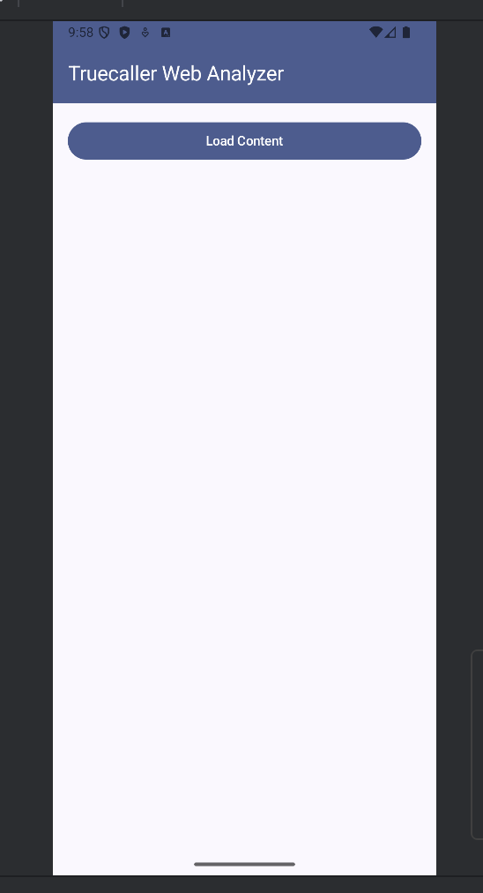
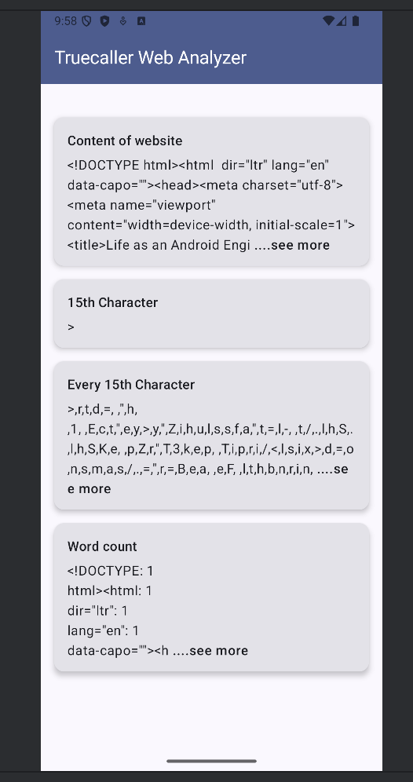
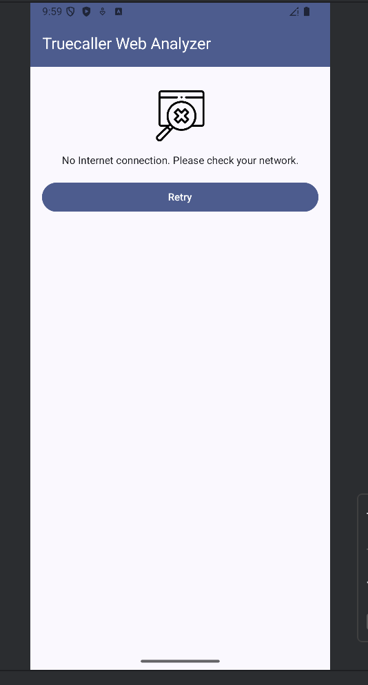
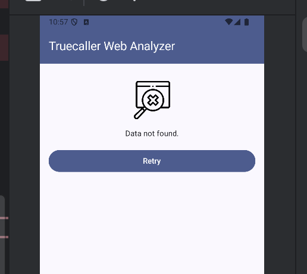

# 📱 Truecaller Assignment

## Problem Statement

Develop an Android application that fetches and processes the content of a webpage and performs three tasks in parallel. Results of each task should be displayed as soon as they're done.

**Target URL:**  
🔗 [Truecaller Blog - Life as an Android Engineer](https://www.truecaller.com/blog/life-at-truecaller/life-as-an-android-engineer)

### Tasks to Perform:
1. **Truecaller15thCharacterRequest**  
   ➜ Find and display the **15th character** of the content.

2. **TruecallerEvery15thCharacterRequest**  
   ➜ Find **every 15th character** (i.e., 15th, 30th, 45th, etc.) and display them in a list.

3. **TruecallerWordCounterRequest**  
   ➜ Count occurrences of each unique word (case-insensitive) by splitting content using whitespaces (space, tabs, line breaks).  
   ➜ Example: `"<p> Truecaller Hello World </p>"` ➜ Counts for `<p>`, `Truecaller`, `Hello`, `World`, `</p>`.

---

## Functional Requirements
- Fetch and display content from the provided URL.
- Display results for:
    - 15th character.
    - Every 15th character.
    - Word frequency count.
- Loading indicator during content fetch.
- Error state UI with a retry option.

---

## Architecture: Clean Architecture (MVI)

> Business logic is independent of frameworks like Android or libraries. Code becomes easier to test, maintain, and extend. Dependencies flow in a single direction (outer to inner layers).

### Dependency Flow Diagram
```
UI Layer (Compose / ViewModel)
↓
Domain Layer (UseCase / Repository Interface)
↓
Data Layer (Repository Implementation)
↓
Data Source (API / DB)
```
Each layer depends **only** on the layer directly below it.

---

## Dependency Injection
- Using **Hilt** for Dependency Injection.
- Inversion of Control (IoC) helps manage dependencies cleanly across layers.

---

## Layer Breakdown

### Presentation Layer (`app` module)
- **Responsibilities**: UI rendering & handling user interactions.
- **Components**:
    - Compose UI
    - ViewModel
- **Communicates with**: Domain Layer (UseCases).

### Domain Layer
- **Responsibilities**: Core business logic & UseCases.
- **Components**:
    - UseCases
    - Repository Interfaces.
- **Communicates with**: Data Layer (via interfaces).
- **Testable & Framework-Independent**.

### Data Layer
- **Responsibilities**: Data fetching & transformations.
- **Components**:
    - Repository Implementations.
    - RemoteDataSource (API via Retrofit).
    - LocalDataSource (Room, if needed).
    - Mappers (DTO ↔ Domain Model).
- **Communicates with**: Domain Layer.

### Network Layer
- **Responsibilities**: API setup and error handling.
- **Components**:
    - Retrofit Client.
    - API Service Interfaces.
    - Network Error Handlers.

---

## 🌀 MVI (Model-View-Intent)

**MVI (Model-View-Intent)** is a unidirectional data flow architecture where **View emits Intents**, **Model processes them**, and **View renders the State**.

### Key Concepts:
- **Intent**: User actions or events (button clicks, screen load, etc.).
- **Model**: Business logic that transforms intents into new UI states.
- **View**: Pure UI renderer that displays the current state.

### MVI Flow:
```
User Intent → ViewModel/Processor → Model → New ViewState → View renders
```

### Benefits of MVI:
- Single source of truth (**ViewState**).
- Predictable state transitions.
- Easier to debug with pure functions.
- Immutability enforces cleaner architecture.

---

## Screens & UI Components

| Screen | Screenshot |
|--------|------------|
| **Main Screen (Button to Load Content)** |  |
| **Content Display (Results View)** |  |
| **Error State View** |  |
| **Alternate Error View** |  |

---

## Tech Stack

- 🟢 **Kotlin**
- 🟦 **Jetpack Compose**
- 🏗️ **MVI Architecture**
- 🧹 **Clean Architecture Principles**
- 🔗 **Hilt (Dependency Injection)**
- 🌐 **Retrofit (Networking)**
- 🔄 **Coroutines & Flow (Async operations)**

### 🧪 Testing Stack
- **JUnit 5** – Unit testing framework.
- **Mockito** – Mocking dependencies.
- **Truth** – Fluent assertions.

---

## Error Handling & Retry Strategy
- Generic HTTP exception handling in **Data Layer**.
- UI displays **Retry Button** on failure.
- **Loading indicators** shown while fetching data.
- Handles common exceptions:
    - **IOException** (Network errors)
    - **HTTP Errors (4xx/5xx)**

---

## Folder Structure
```
com.example.truecallerassignment
├── data
│   ├── repository
│   └── remote
├── domain
│   ├── model
│   └── usecase
├── presentation
│   ├── ui
│   └── viewmodel
└── utils
```

---

## How to Run
1. Clone this repository.
2. Open in **Android Studio Hedgehog (or newer)**.
3. Build & Run on an emulator or device.

---

## Author
Priya Gupta

---